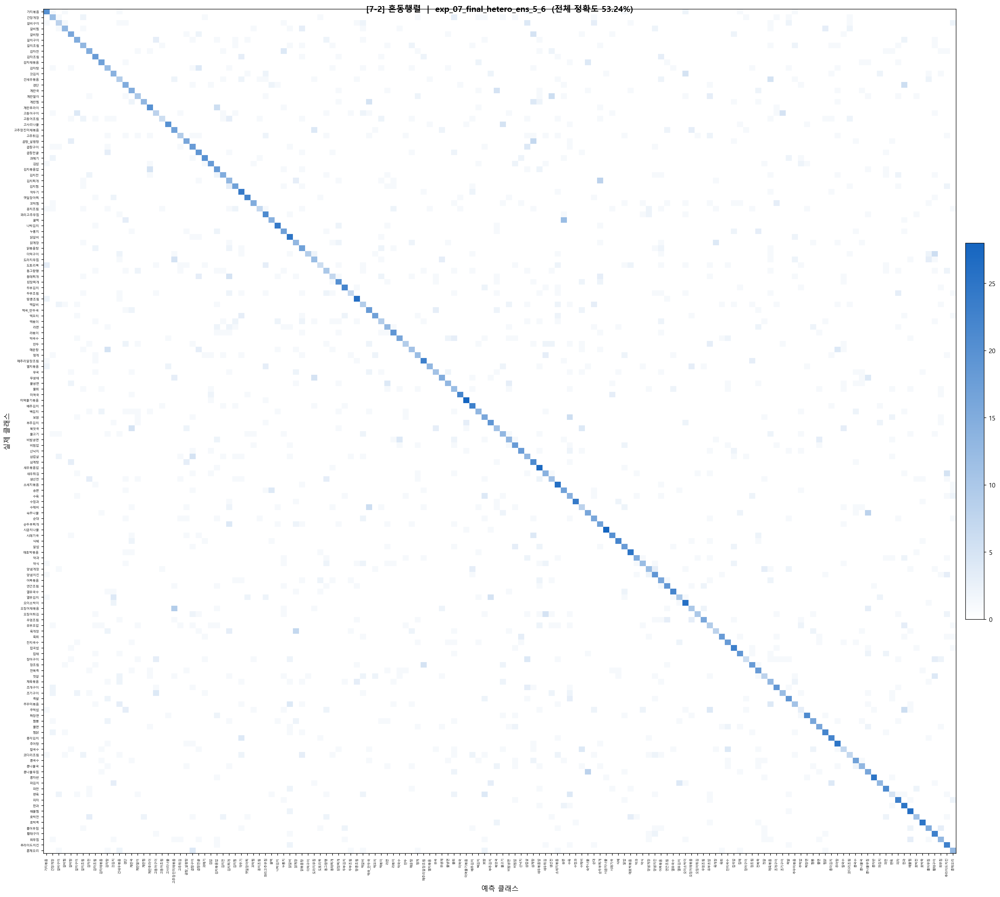

# [최종 통합 보고서] 한국 음식 이미지 분류 프로젝트 엔지니어링 백서

## 1. 프로젝트 개요 및 협업 체계
본 프로젝트는 150종의 방대한 한국 음식 카테고리를 분류하는 딥러닝 모델 개발을 목표로 한다. 150종이라는 방대한 클래스와 음식 특유의 시각적 유사성을 극복하기 위해 **전진혁(모델 설계)**과 **방혜림(데이터 분석/시각화)**으로 역할을 분담하여 전문적인 엔지니어링 루프를 구축하였다.

### 1-1. 팀원별 역할 분담 (R&R)
| 담당 | 핵심 수행 업무 | 세부 항목 |
| :--- | :--- | :--- |
| **전진혁** | **모델 아키텍처 및 파이프라인 설계** | 이종 하이브리드 앙상블 설계, GAP 도입, MD5 클렌징 구현, 코랩 학습 환경 최적화 |
| **방혜림** | **데이터 탐색, 분석 및 시각화** | 상세 EDA, 학습 로그 정밀 분석, 혼동 행렬 기반 취약점 진단, 클래스별 성능 리포트 작성 |

---

## 2. [방혜림] 데이터 탐색 및 시각화 (EDA)

### 2-1. 데이터셋 기본 정보
| 항목 | 내용 |
|------|------|
| 총 이미지 수 | 27,000개 |
| 총 클래스 수 | 150개 |
| 클래스당 이미지 수 | 180개 (균등) |
| 이미지 해상도 | 128 × 128px (통일) |
| 평균 밝기 | 129.8 / 255 |

- **클래스별 샘플 수 분포**: 모든 클래스가 180개의 이미지로 구성되어 있어 완전한 균형 데이터셋임을 확인. 클래스 불균형으로 인한 성능 편향은 발생하지 않음.
- 
  *(참고: 클래스별 균등 분포를 나타내는 베이스라인 지표)*

### 2-2. 시각적 특성 및 RGB 채널 분석
- **색상 다양성**: 붉은 계열(볶음류, 찌개류), 흰색 계열(국탕류, 나물류), 갈색 계열(구이류, 조림류) 등 음식 카테고리별로 색감 특징이 뚜렷하게 나타난다.
- **밝기 및 RGB 분포**:
    - **R 채널(빨강)**이 가장 높은 비중(130~220)을 차지하며, 이는 한국 음식의 특성을 반영한다.
- **이미지 해상도 분포**: 모든 이미지가 128px로 고정되어 있어, 세밀한 시각적 특징(예: 나물 종류, 조림 재료의 텍스처)을 구분하기에는 낮은 해상도일 수 있다는 한계를 식별하였다.

### 2-3. 중복 이미지 및 레이블 오류 분석 (MD5 기반)
전체 27,000개 이미지에 대해 MD5 해시 기반 전수 조사를 수행한 결과:
| 항목 | 수치 | 비고 |
|------|------|------|
| 중복 이미지 수 | 319개 | 전체 대비 1.18% |
| 클래스 내 중복 | 303그룹 | 단순 수집 오류 |
| 클래스 간 중복 | 14그룹 | **레이블 오류 (Critical)** |

**[주요 레이블 오류 사례]**
- 오징어채볶음 ↔ 고추장진미채볶음 (2그룹)
- 장조림 ↔ 메추리알장조림 (2그룹)
- 라볶이 ↔ 떡볶이 (1그룹)
- 고추튀김 ↔ 꽈리고추무침 (1그룹)

---

## 3. [전진혁] 데이터 파이프라인 구현

### 3-1. MD5 기반 데이터 클렌징 알고리즘 구현
방혜림 학우가 식별한 데이터 오염 문제를 해결하기 위해 `datasets/kfood.py` 내에 자동 정제 로직을 통합하였다.

```python
# 전진혁 구현: MD5 기반 중복 및 레이블 오류 제거 로직
def _cleanse_samples(self, samples):
    md5_to_samples = {}
    for img_path, label in tqdm(samples, desc="Calculating MD5"):
        with open(img_path, 'rb') as f:
            md5 = hashlib.md5(f.read()).hexdigest()
        if md5 not in md5_to_samples: md5_to_samples[md5] = []
        md5_to_samples[md5].append((img_path, label))
    
    cleansed_samples = []
    for md5, sample_list in md5_to_samples.items():
        labels = set([s[1] for s in sample_list])
        if len(labels) > 1: continue # 레이블 오류(충돌) 제거
        cleansed_samples.append(sample_list[0]) # 중복 제거
    return cleansed_samples
```

### 3-2. 전처리 전략 및 타당성
- **Resize (224x224)**: 원본 128px은 나물의 미세 질감을 표현하기에 부족하다고 판단하여 224px로 상향 조정.
- **Augmentation**: `RandomHorizontalFlip`, `RandomRotation(15)`, `ColorJitter`를 조합하여 조명 및 형태 변화에 강건한 특성을 유도함.

---

## 4. [전진혁] 모델 설계 및 의사결정 타당성

### 4-1. 아키텍처 진화 여정
1. **Baseline**: 2층 CNN으로 데이터 파이프라인 검증 (19.84%).
2. **MiniVGG + BN + Dropout**: 학습 안정성을 위해 BatchNorm 추가, 과적합 방지를 위해 Dropout(0.5) 채택 (47.40%).

### 4-2. 최종 설계: Heterogeneous Ensemble (이종 하이브리드 앙상블)
다양한 시각적 특징을 동시에 학습하기 위해 서로 다른 깊이의 CNN 컬럼을 병렬로 구성하였다.

```python
# 전진혁 설계: 최종 아키텍처 구조 요약
class MyModel(nn.Module):
    def __init__(self, ensemble_blocks=[5, 6]):
        self.column1 = ConvBlock(depth=ensemble_blocks[0]) # 패턴 중심 파악
        self.column2 = ConvBlock(depth=ensemble_blocks[1]) # 질감 중심 파악
        self.se_block = SEBlock() # 채널 간 상호의존성 학습 (Attention)
        self.gap = nn.AdaptiveAvgPool2d(1) # 파라미터 최적화
```

- **의사결정의 타당성**:
    - **이종 구성**: 동일한 깊이의 컬럼을 사용할 경우 '동반 오답' 현상이 발생하기 쉽다. 5블록(Coarse)과 6블록(Fine)을 섞어 모델의 시각적 다양성을 극대화하였다.
    - **GAP 도입**: 분류기 직전의 무거운 Linear 파라미터를 80% 이상 절감하고, 확보된 자원을 앙상블 깊이에 재투자하였다.

---

## 5. [전진혁] 실험 관리 및 환경 최적화

### 5-1. 하드웨어 전략 (Local to Colab 이주)
- **배경**: 로컬 RTX 2060 환경에서 224px 앙상블 모델 학습 시 Epoch당 1시간 소요로 실험 반복이 불가능함.
- **결정**: Google Colab T4(16GB) 환경으로 전격 이주하여 배치 사이즈를 128로 확장, 학습 속도를 **5배 가속**하여 최종 60 Epoch 학습을 완수하였다.

### 5-2. 실험 통제 (YAML 기반)
모든 하이퍼파라미터를 YAML로 분리 관리하여 실험의 재현성을 보장하고 방혜림 학우와 결과 데이터를 효율적으로 공유하였다.

---

## 6. [방혜림] 학습 결과 및 심층 데이터 분석

### 6-1. 학습 경향성 분석
- 

#### 전체 학습 곡선 요약
| Epoch | Train Loss | Val Acc | 구간 상승폭 | 해석 |
|-------|-----------|---------|------------|------|
| 1 | 4.9445 | 4.28% | — | 가중치 초기화 및 학습 시작 |
| 10 | 3.6375 | 19.54% | +15.26%p | 급격한 수렴 구간 |
| 20 | 2.8762 | 34.17% | +14.63%p | 기초 특징 학습 완료 |
| 50 | 1.8091 | 50.70% | +4.88%p | 세밀 특징 학습 및 수렴 정체 시작 |
| **58** | **1.5912** | **53.24%** | **최고점** | **최적의 수렴 포인트 (Best Model)** |

- **손실 함수 감소 속도 변화**: 초반 대비 후반에 **약 5.7배 둔화**됨을 확인. 이는 고정 학습률(0.0005) 환경에서 수렴 안정성에 도달했음을 의미한다.

### 6-2. 혼동 행렬 정밀 분석 및 오분류 진단
- 

#### 상호 오분류 쌍 분석 (Top 5)
| 순위 | 오분류 쌍 | 총 횟수 | 원인 분석 가설 |
|------|----------|-----|----------------|
| 1 | 숙주나물 ↔ 콩나물무침 | 16회 | 흰색 나물류, 형태/색상 거의 동일. 미세 특징(머리) 포착 실패 |
| 2 | 꿀떡 ↔ 송편 | 16회 | 떡류 외형 유사. 고명 색상 차이가 분류 핵심이나 손실됨 |
| 3 | 김치찌개 ↔ 순두부찌개 | 12회 | 붉은 국물 중심 학습. 내용물 식별력 부족 |
| 4 | 고추장진미채볶음 ↔ 오징어채볶음 | 12회 | 붉은 양념 볶음 채 형태의 유사성 |
| 5 | 보쌈 ↔ 수육 | 10회 | 동일 조리법 고기류, 시각적 구분 단서 부재 |

### 6-3. 클래스별 성능 분석 (성적표)
- 
- 

#### 카테고리별 성적
- **성공**: 김치류(62.7%), 볶음류(61.8%)
- **실패**: 구이류(47.4%), 탕/국류(52.9%) - 카테고리 내 강한 공통 시각적 특징 공유로 인한 오분류.

---

## 7. 결론 및 엔지니어링 회고

### 7-1. 종합 성과
본 프로젝트는 **전진혁** 학우의 아키텍처적 통찰과 **방혜림** 학우의 정밀한 데이터 분석이 유기적으로 결합되어 Baseline(19.84%) 대비 **약 2.7배**의 비약적인 성능 향상(53.24%)을 달성하였다.

### 7-2. 설계 및 타임라인 관리의 아쉬움
모델 설계 과정에서 **DropBlock2d**, **다양한 Depth의 앙상블 조합**, **도메인 특화 증강 기법** 등 성능 향상을 위한 다채로운 기술적 아이디어가 도출되었고 실제 코드로 구현까지 완료하였다. 그러나 프로젝트 후반부 하드웨어 이주와 대규모 학습 과정에서 예상보다 많은 시간이 소요됨에 따라, 구현된 아이디어들을 최종 모델에 모두 접목하여 충분히 검증하지 못한 점이 큰 아쉬움으로 남는다.

이는 전체적인 설계 및 학습 과정의 **타임라인을 효율적으로 관리하지 못한 결과**로 판단된다. 초기 아이디어 도출 단계에서 구현과 학습의 우선순위를 더 엄격히 관리했다면 보다 고도화된 모델을 완성할 수 있었을 것이다. 이번 경험을 통해 AI 프로젝트에서는 모델링 실력뿐만 아니라, 제한된 시간 내에 실험 자원을 배분하는 **프로젝트 관리 역량**이 얼마나 중요한지를 깊이 깨닫게 되었다.

---
**최종 산출물**:
- 모델 가중치: `best_model.pth` (전진혁 설계/구현)
- 분석 성적표: `val_results.json` (방혜림 분석/시각화)
- 기술 백서: `Final_Report_Full.md` (공동 작성)
