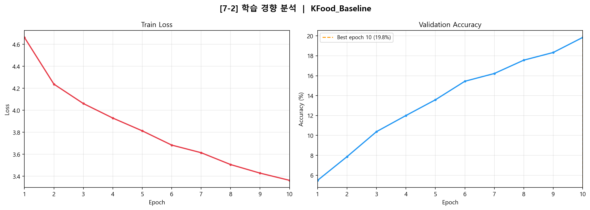
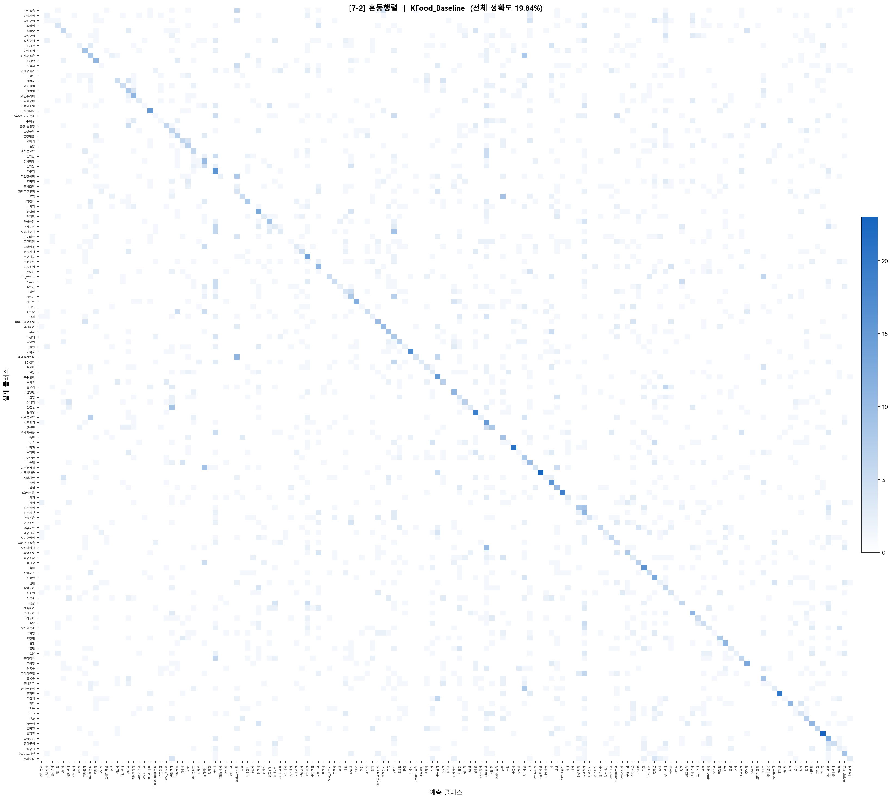
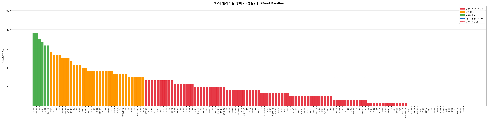
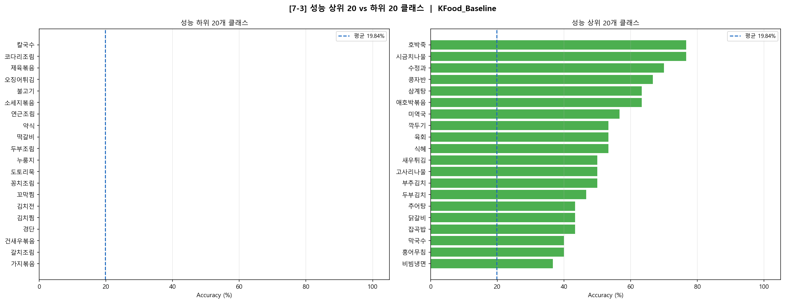

# 한국 음식 이미지 분류 모델 분석 보고서 (Baseline)

- **모델명**: KFood_Baseline
- **클래스 수**: 150개
- **학습 Epoch**: 10
- **최종 검증 정확도**: 19.84%

---

## 7-2. 학습 경향 분석

### 7-2-1. 학습 경향성 분석

#### 전체 학습 로그

| Epoch | Train Loss | Val Acc |
|-------|-----------|---------|
| 1 | 4.6621 | 5.49% |
| 2 | 4.2375 | 7.87% |
| 3 | 4.0611 | 10.38% |
| 4 | 3.9291 | 12.00% |
| 5 | 3.8128 | 13.58% |
| 6 | 3.6833 | 15.44% |
| 7 | 3.6140 | 16.22% |
| 8 | 3.5062 | 17.56% |
| 9 | 3.4282 | 18.33% |
| **10** | **3.3627** | **19.84%** |

#### 분석

**전반적 경향**

Train Loss는 4.6621에서 3.3627로 꾸준히 감소하고, Validation Accuracy는 5.49%에서 19.84%로 매 epoch마다 단조 증가하는 안정적인 학습 패턴을 보임. 출렁임 없이 일관되게 향상되고 있어 초기 학습 단계로서는 정상적인 흐름

**핵심 문제점**

- **epoch 10에서 수렴 여부 불명확**: Loss가 여전히 감소 중이고 Val Acc도 계속 오르는 상태에서 학습이 종료. 즉 학습이 아직 끝나지 않은 상태
- **19.84%는 매우 낮은 성능**: 150개 클래스 랜덤 추측 확률이 0.67%임을 감안하면 학습 자체는 이루어지고 있으나, 실용적인 수준에는 크게 미치지 못함
- **학습 속도 느림**: 10 epoch 동안 Loss 감소폭이 완만하여 학습률이 낮거나 모델 용량이 부족할 가능성이 있음

---

### 7-2-2. 대응 전략

| 문제 | 원인 가설 | 대응 전략 |
|------|---------|---------|
| epoch 10에서 미수렴 | 학습 epoch 부족 | epoch 수 대폭 증가 (30~100 epoch) |
| 낮은 학습 속도 | Learning Rate 과소 | Learning Rate 증가 또는 스케줄러 적용 |
| 19.84% 낮은 성능 | 모델 용량 부족 | 레이어 수 증가, 채널 수 확대 |
| 19.84% 낮은 성능 | 데이터 다양성 부족 | Data Augmentation 적용 |
| 20개 클래스 0% 정확도 | 학습 부족 | epoch 증가 시 자연스럽게 개선 기대 |

---

### 7-2-3. 혼동행렬 분석

혼동행렬을 시각화한 결과, 대각선 원소(정답)의 값이 전반적으로 매우 낮고 비대각선 영역에 오답이 분산되어 있음. 이는 모델이 아직 대부분의 클래스를 제대로 학습하지 못한 초기 상태임을 나타냄

주요 혼동 쌍은 다음과 같음.

| 혼동 쌍 | 혼동 횟수 | 혼동 원인 |
|--------|---------|---------|
| 꿀떡 ↔ 송편 | 12회 | 유사한 둥근 형태 및 색감 |
| 꽈리고추무침 ↔ 미역줄기볶음 | 12회 | 초록색 채소 반찬 유사 |
| 양념게장 ↔ 양념치킨 | 11회 | 붉은 양념 색감 유사 |
| 도라지무침 ↔ 무생채 | 11회 | 흰색 채 형태 나물 유사 |
| 김치찌개 ↔ 순두부찌개 | 11회 | 붉은 국물 찌개 유사 |
| 곱창구이 ↔ 삼겹살 | 10회 | 구이류 색감 및 질감 유사 |
| 새우튀김 ↔ 오징어튀김 | 10회 | 튀김류 외형 유사 |
| 깍두기 ↔ 총각김치 | 9회 | 김치류 색감 유사 |
| 숙주나물 ↔ 콩나물무침 | 8회 | 흰 나물 무침 유사 |

---

## 7-3. 클래스별 성능 분석

### 7-3-1. 클래스별 정확도 시각화

---

### 7-3-2. 성능 분포 요약

| 구간 | 클래스 수 | 비율 |
|------|---------|------|
| 60% 이상 | 6개 | 4.0% |
| 30~60% | 33개 | 22.0% |
| 0% 초과~30% 미만 | 91개 | 60.7% |
| **0% (완전 미학습)** | **20개** | **13.3%** |

**성능 상위 5개 클래스**

| 클래스 | 정확도 |
|-------|-------|
| 호박죽 | 76.67% |
| 시금치나물 | 76.67% |
| 수정과 | 70.00% |
| 콩자반 | 66.67% |
| 삼계탕 | 63.33% |

**0% 정확도 클래스 (20개)**

가지볶음, 갈치조림, 건새우볶음, 경단, 김치전, 김치찜, 꼬막찜, 꽁치조림, 누룽지, 도토리묵, 두부조림, 떡갈비, 불고기, 소세지볶음, 약식, 연근조림, 오징어튀김, 제육볶음, 칼국수, 코다리조림

---

### 7-3-3. 성능 저하 원인 가설

**가설 1 — 학습 epoch 절대적 부족**

전체 150개 클래스 중 20개(13.3%)가 정확도 0% 이는 10 epoch이라는 짧은 학습 시간 동안 모델이 해당 클래스의 특징을 전혀 학습하지 못했음을 의미. 상위 클래스들도 대부분 50~76% 수준으로 충분한 학습이 이루어지지 않은 상태

**가설 2 — 시각적 유사성**

상위 클래스를 보면 호박죽(진한 노란색), 시금치나물(선명한 녹색), 수정과, 식혜 등 색상이나 형태가 타 클래스와 뚜렷이 구분되는 음식들. 반면 0% 클래스인 가지볶음, 건새우볶음, 코다리조림 등은 색상이나 형태가 다른 클래스와 유사하여 구분이 어려움

**가설 3 — 모델 용량 부족**

150개 클래스를 구분하기엔 현재 Baseline 모델의 표현력이 부족할 수 있다. 특히 세밀한 시각적 차이를 학습하기 위한 깊은 레이어 구조가 필요

---

### 7-3-4. 개선 방향

| 원인 | 개선 방향 |
|------|---------|
| epoch 부족 | epoch 30 이상으로 증가 |
| 학습 속도 느림 | Learning Rate 조정 및 스케줄러 적용 |
| 시각적 유사 클래스 혼동 | Hard Negative Mining — 혼동 쌍 집중 학습 |
| 모델 용량 부족 | 레이어 수 증가, Residual Connection 도입 등 |
| 데이터 다양성 부족 | Data Augmentation 강화 (색상 변환, 회전, 밝기 조정 등) |
| 0% 클래스 존재 | 해당 클래스 샘플 오버샘플링 또는 Focal Loss 적용 |

---
