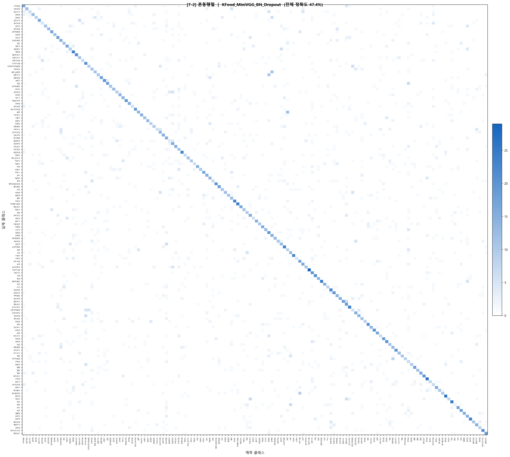
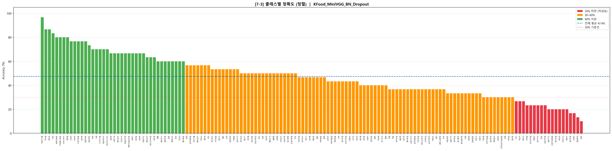
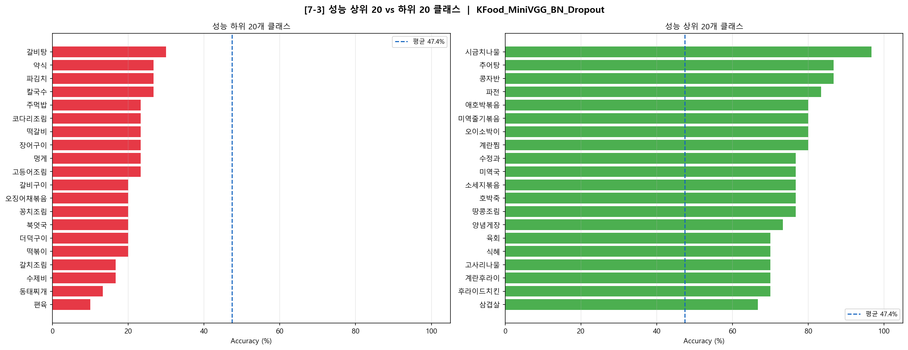

# 한국 음식 이미지 분류 모델 분석 보고서

- **모델명**: KFood_MiniVGG_BN_Dropout
- **클래스 수**: 150개
- **전체 검증 정확도**: 47.4% (+27.56%p 증가)
- **학습 epoch**: 30 (epoch 20 증가)

## 이전 모델과의 비교 (KFood_MiniVGG_BN_Dropout)

| 항목 | Baseline (v1) | 업데이트 모델 (v2) | 변화 |
|------|-------------|----------------|------|
| 모델명 | KFood_Baseline | KFood_MiniVGG_BN_Dropout | 아키텍처 개선 |
| 학습 Epoch | 10 | 30 | +20 epoch |
| 최종 Val Acc | 19.84% | 47.40% | **+27.56%p** |
| 0% 클래스 수 | 20개 | 0개 | 완전 해소 |
| 60% 이상 클래스 | 6개 | 40개 | +34개 |
| 최고 성능 클래스 | 호박죽 76.67% | 시금치나물 96.67% | +20%p |
| 최저 성능 클래스 | 가지볶음 0% | 편육 10% | 개선 |

epoch 증가와 아키텍처 개선(BatchNorm, Dropout 추가)으로 전체 정확도가 19.84%에서 47.40%로 크게 향상되었으며, 0% 클래스가 완전히 해소됨. 그러나 여전히 47.40% 수준으로 추가적인 개선이 필요한 상태

---

## 7-2. 학습 경향 분석

### 7-2-1. 학습 경향성 분석

epoch별 Train Loss와 Validation Accuracy 변화

#### 구간별 분석

**구간 1 — Epoch 1~8 (초기 학습)**

Train Loss가 4.50에서 2.71로 빠르게 감소하고, Validation Accuracy는 8.2%에서 33.78%로 급격히 상승.

**구간 2 — Epoch 9~19 (불안정 구간)**

Train Loss는 2.58에서 1.61로 꾸준히 감소하였으나, Validation Accuracy는 출렁임을 보였다.

| Epoch | Train Loss | Val Acc | 비고 |
|-------|-----------|---------|------|
| 8 | 2.71 | 33.78% | |
| 9 | 2.58 | 27.38% | 급락 |
| 16 | 1.86 | 42.51% | |
| 17 | 1.77 | 36.13% | 급락 |
| 20 | 1.54 | 45.09% | 회복 |

Loss는 감소하는데 Validation Accuracy가 오히려 하락하는 구간이 반복적으로 나타남. 학습률이 과도하여 가중치 업데이트가 불안정하게 이루어졌을 가능성 있음.

**구간 3 — Epoch 20~30 (안정화 및 수렴)**

Validation Accuracy의 출렁임이 감소하고 45~47% 수준에서 수렴. Best 성능은 Epoch 29에서 **47.40%**, Epoch 30에서 47.29%로 소폭 하락하여 수렴 신호가 나타남.

#### 핵심 문제점 요약

1. **Loss ↓ 인데 Val Acc ↓ 구간 존재**: 학습 데이터에는 점점 맞춰지지만 검증 데이터에 대한 일반화가 불안정함
2. **Val Acc 47% 수준에서 수렴**: 150개 클래스 분류 과제에 비해 낮은 수렴 성능

---

### 7-2-2. 대응 전략

| 문제 | 가설 | 대응 전략 |
|------|---------|---------|
| Val Acc 출렁임 | Learning Rate 과대 | Learning Rate Scheduler 적용 (CosineAnnealing, StepLR) |
| Loss↓ & Val Acc↓ 동시 발생 | 가중치 업데이트 불안정 | 학습률 자체를 낮추기 |
| 47%에서 조기 수렴 | 데이터 부족 및 다양성 부족 | Data Augmentation 강화 |

---

### 7-2-3. 혼동행렬 분석

혼동행렬을 시각화한 결과, 대각선 외 영역에서 특정 클래스 쌍 간의 집중적인 혼동 패턴이 관찰됨

주요 혼동 쌍은 다음과 같음.

| 혼동 쌍 | 혼동 횟수 | 혼동 원인 |
|--------|---------|---------|
| 꿀떡 ↔ 송편 | 16회 | 유사한 둥근 형태 및 색감 |
| 곰탕_설렁탕 ↔ 삼계탕 | 12회 | 흰 국물 외형 유사 |
| 곱창구이 ↔ 삼겹살 | 11회 | 구이류 색감 및 질감 유사 |
| 고추장진미채볶음 ↔ 오징어채볶음 | 11회 | 채 형태 + 붉은 양념 유사 |
| 계란말이 ↔ 생선전 | 10회 | 노란 직사각형 형태 유사 |
| 숙주나물 ↔ 콩나물무침 | 10회 | 흰 나물 무침 외형 유사 |
| 김밥 ↔ 주먹밥 | 9회 | 밥+김 조합 유사 |
| 수육 ↔ 편육 | 8회 | 삶은 돼지고기 외형 동일 |
| 제육볶음 ↔ 주꾸미볶음 | 8회 | 붉은 양념 볶음 유사 |
| 갈치구이 ↔ 고등어구이 | 8회 | 생선 구이 외형 유사 |
| 갈치조림 ↔ 고등어조림 | 8회 | 생선 조림 외형 유사 |
| 김치찌개 ↔ 동태찌개 | 8회 | 붉은 국물 찌개 유사 |

---

## 7-3. 클래스별 성능 분석

### 7-3-1. 클래스별 정확도 시각화

### 7-3-2. 성능 분포 요약

| 구간 | 클래스 수 | 비율 |
|------|---------|------|
| 60% 이상 | 40개 | 26.7% |
| 30~60%| 91개 | 60.7% |
| 30% 미만  | 19개 | 12.7% |

**성능 상위 5개 클래스**

| 클래스 | 정확도 |
|-------|-------|
| 시금치나물 | 96.7% |
| 추어탕 | 86.7% |
| 콩자반 | 86.7% |
| 파전 | 83.3% |
| 애호박볶음 | 80.0% |

**성능 하위 5개 클래스**

| 클래스 | 정확도 |
|-------|-------|
| 편육 | 10.0% |
| 동태찌개 | 13.3% |
| 수제비 | 16.7% |
| 갈치조림 | 16.7% |
| 떡볶이 | 20.0% |

 이전 모델과 비교했을 때 성능 0% 클래스의 수가 20개에서 0개로 완전 해소됨.  

---

### 7-3-3. 성능 저하 원인 가설

**가설 1 — 시각적 유사성**

편육(10%), 수육, 보쌈은 모두 삶은 돼지고기를 썰어낸 형태로 외형이 거의 동일. 동태찌개(13.3%)는 김치찌개와 국물 색이 유사하여 혼동이 빈번하게 발생함. 모델이 클래스 고유의 특징보다 전체적인 색감과 형태에 의존하고 있을 가능성이 높음

**가설 2 — 클래스 내 다양성 과대**

갈치조림(16.7%)은 조리 방법, 양념 색상, 담음새에 따라 이미지 간 편차 큼. 클래스 내부 다양성이 높을수록 모델이 일관된 특징을 학습하기 어려움

---

### 7-3-4. 개선 방향 제시

| 원인 | 개선 방향 |
|------|---------|
| 시각적 유사 클래스 혼동 | Hard Negative Mining — 혼동 쌍 위주로 추가 학습 |
| 클래스 내 다양성 과대 | Data Augmentation 강화 (색상, 밝기, 회전 등) |

