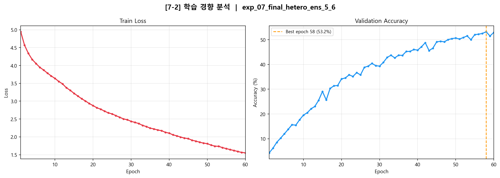
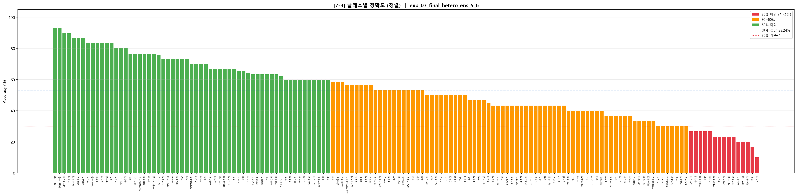
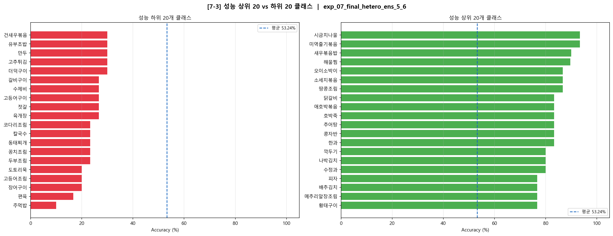

# 7-2. 학습 경향 분석 및 7-3. 클래스별 성능 분석

- **모델명**: Heterogeneous Ensemble (5-Block + 6-Block CNN) + SE Block + GAP  
- **전체 검증 정확도**: 53.24% (Epoch 58, best_model.pth 기준)  
- **학습 epoch**: 60 (epoch 30 증가)


검증 데이터셋 기준 전체 정확도는 53.24%를 기록하였으며 클래스 간 성능 편차가 극단적으로 발생하였다. 성능 하락을 주도한 '양념 기반 음식 카테고리'의 오분류 사례를 정성적으로 추적 분석하였다.


## 이전 모델과의 비교

| 항목 | v2 | v3 |변화 |
|------|-------------|----------------|------|
| 모델명 | KFood_Baseline | KFood_MiniVGG_BN_Dropout | 아키텍처 개선 |
| 학습 Epoch | 30 | 60 | +30 epoch |
| 최종 Val Acc | 47.40% | 53.24% | **+5.84%p** |


## 7-2. 학습 경향 분석

### 7-2-1. 학습 경향성 분석



#### 전체 학습 곡선 요약

| Epoch | Train Loss | Val Acc | 구간 상승폭 |
|-------|-----------|---------|------------|
| 1 | 4.9445 | 4.28% | — |
| 5 | 4.0566 | 11.98% | — |
| 10 | 3.6375 | 19.54% | +15.26%p (1→10) |
| 20 | 2.8762 | 34.17% | +14.63%p (10→20) |
| 30 | 2.4351 | 39.36% | +5.19%p (20→30) |
| 40 | 2.1041 | 45.82% | +6.46%p (30→40) |
| 50 | 1.8091 | 50.70% | +4.88%p (40→50) |
| 58 | 1.5912 | **53.24%** ★ | 최고점 |
| 60 | 1.5522 | 52.93% | +2.23%p (50→60) |

#### 구간별 분석

**구간 1 — 급격한 초기 수렴 (Epoch 1~20)**

- 검증 정확도: 4.28% → 34.17% (+29.89%p)
- 손실 함수: 4.9445 → 2.8762 (epoch당 평균 0.145 감소)
- **해석**: 모델이 150개 클래스의 기초 특징(색상, 전반적인 형태)을 빠르게 학습하는 구간. BatchNorm이 학습 초반 gradient 흐름을 안정화하여 수렴 속도를 가속함. 5-Block 컬럼과 6-Block 컬럼 모두 풍부한 gradient 신호를 받아 효율적으로 업데이트됨

**구간 2 — 완만한 중기 상승 (Epoch 20~50)**

- 검증 정확도: 34.17% → 50.70% (+16.53%p)
- 손실 함수: 2.8762 → 1.8091 (epoch당 평균 0.036 감소)
- **해석**: 쉽게 구별되는 클래스 학습이 완료된 후, 시각적으로 유사한 클래스 쌍(예: 숙주나물↔콩나물무침, 꿀떡↔송편)을 구분하는 세밀한 특징 학습 구간으로 전환된다. 상승 속도가 Phase 1의 약 1/3 수준으로 감소한다.

**구간 3 — 수렴 및 진동 (Epoch 50~60)**

- 검증 정확도: 50.70% → 53.24% (최고점) → 52.93% (최종)
- Epoch 50~60 val_acc 표준편차: **1.070%p**
- **해석**: 손실 함수는 1.5522까지 지속 감소하나(훈련 데이터에 대한 학습은 진행 중), 검증 정확도는 50~53% 구간에서 진동한다. 이는 훈련 손실과 검증 성능 간의 괴리가 발생하는 **초기 과적합 진입 신호**로 해석된다.

#### 손실 함수 감소 속도 변화

| 구간 | 평균 Loss 감소 / Epoch |
|------|----------------------|
| Epoch 1~10 | 0.1452 |
| Epoch 50~60 | 0.0257 |
| 감소율 | 약 **5.7배** 둔화 |

손실 감소 속도는 학습 초반 대비 후반에 5.7배 둔화되었다. 이는 고정 학습률(0.0005) 환경에서 손실 경관(Loss Landscape)의 평탄한 영역에 진입했음을 의미한다.

---

#### 학습 경향성 분석 결과 및 대응 전략

**관찰된 문제 1: 고정 학습률로 인한 후반 수렴 정체**

- **근거**: Epoch 50~60 구간 검증 정확도 상승폭 +2.23%p, 표준편차 1.07%p
- **대응 전략**: `CosineAnnealingLR` 또는 `ReduceLROnPlateau` 스케줄러 도입 권장. 학습 후반 학습률을 점진적으로 감소(예: 0.0005 → 0.0001)시켜 더 세밀한 가중치 업데이트를 유도할 수 있다.

  ```yaml
  # 권장 설정 (configs에 추가)
  train:
    scheduler: "CosineAnnealingLR"
    scheduler_T_max: 60
    scheduler_eta_min: 0.00005
  ```

**관찰된 문제 2: 훈련 손실은 감소하나 검증 정확도가 진동**

- **근거**: Epoch 58에서 검증 정확도 최고점(53.24%) 기록 후, Epoch 59(51.53%)로 하락, Epoch 60(52.93%)으로 반등하는 패턴
- **대응 전략**: Early Stopping 기준을 검증 정확도 기반으로 설정하고, 현재 적용 중인 `best_model.pth` 저장 방식을 유지한다. 추가로 patience=10 이상의 Early Stopping을 도입하면 불필요한 Epoch 소비를 방지할 수 있다.

---

### 7-2-2. 혼동 행렬 시각화 및 분석

#### 혼동 행렬 개요

- **전체 샘플**: 4,489개 (클래스당 약 29.9개, 28~30개)
- **정분류**: 2,390개
- **오분류**: 2,099개
- **데이터 불균형 여부**: 클래스당 샘플 수가 28~30으로 균등 분포 → 클래스 불균형이 성능 차이의 원인이 아님을 확인

#### 전체 혼동 행렬 (150×150) 패턴 해석


> **시각화 방법**: 혼동 행렬은 히트맵 형태로 표현할 때 대각선의 밀도가 높을수록 우수한 모델임을 나타낸다. 현재 모델은 대각선 집중도가 높으나, 특정 클래스 군집 내에서 밀집된 오분류 패턴이 관찰된다.

#### 상호 오분류 쌍 분석 (합계 8회 이상)

상호 오분류(A→B와 B→A가 동시에 발생)는 모델이 두 클래스를 구분하는 결정 경계를 학습하지 못했음을 나타낸다.

| 순위 | 오분류 쌍 | 총 오분류 횟수 | A→B | B→A | 오분류 원인 가설 |
|------|----------|-------------|-----|-----|----------------|
| 1 | 숙주나물 ↔ 콩나물무침 | 16회 | 8 | 8 | 흰색 나물류, 형태·색상 거의 동일. 콩나물 노란 머리 미세 차이 |
| 2 | 꿀떡 ↔ 송편 | 16회 | 12 | 4 | 떡류 외형 유사. 고명 색상 차이가 분류 핵심이나 224px에서도 구분 어려움 |
| 3 | 김치찌개 ↔ 순두부찌개 | 12회 | 8 | 4 | 붉은 국물 탕류. 순두부의 흰 덩어리 유무 |
| 4 | 고추장진미채볶음 ↔ 오징어채볶음 | 12회 | 3 | 9 | 붉은 양념 볶음 채 형태, 식재료 형상 유사 |
| 5 | 닭계장 ↔ 육개장 | 11회 | 4 | 7 | 붉은 국물에 고기+채소 구성, 닭고기 vs 소고기 판별 어려움 |
| 6 | 계란후라이 ↔ 김치볶음밥 | 11회 | 6 | 5 | 둘 다 계란이 포함되며 밥 위에 올려진 구성 |
| 7 | 보쌈 ↔ 수육 | 10회 | 6 | 4 | 동일한 조리법의 삶은 돼지고기, 거의 동일한 외형 |
| 8 | 곰탕_설렁탕 ↔ 삼계탕 | 10회 | 7 | 3 | 흰 국물 탕류, 삼계탕의 닭다리뼈가 핵심 단서 |
| 9 | 계란국 ↔ 북엇국 | 10회 | 5 | 5 | 맑은 국물 기반, 계란 풀기 vs 북어채 구분 어려움 |
| 10 | 곱창구이 ↔ 삼겹살 | 9회 | 4 | 5 | 구이류 갈색 표면, 형태 차이가 미세 |

#### 오분류 패턴 카테고리 분류

혼동 행렬 분석 결과, 오분류는 6가지 패턴으로 집중된다.

**패턴 1: 동일 색상·형태 나물/무침류**
- 대표 사례: 숙주나물↔콩나물무침 (16회), 도라지무침↔무생채 (8회), 고추장진미채볶음↔도라지무침 (9회)
- **공통점**: 흰색 또는 유사 색상의 채 형태 나물류. 핵심 단서(콩나물 노란 머리, 도라지 흰 단면)가 저해상도에서 손실됨

**패턴 2: 동일 국물 색상 탕/찌개류**
- 대표 사례: 김치찌개↔순두부찌개 (12회), 닭계장↔육개장 (11회), 곰탕↔삼계탕 (10회), 계란국↔북엇국 (10회), 갈비탕↔삼계탕 (8회)
- **공통점**: 국물 색상(붉음/흰색)이 같고, 건더기 구성만 다름. 모델이 그릇 외형과 국물 색상에 의존하는 경향

**패턴 3: 조리 방법이 동일한 고기류**
- 대표 사례: 보쌈↔수육 (10회), 곱창구이↔삼겹살 (9회), 편육→수육/보쌈 (8회), 갈비구이→삼겹살 (4회)
- **공통점**: 수육과 보쌈은 동일한 조리법, 삼겹살과 곱창구이는 유사한 구이 질감. 의미론적 차이(부위, 동물)를 시각적으로 구별하는 데 한계

**패턴 4: 떡/경단류 간 혼동**
- 대표 사례: 꿀떡↔송편 (16회), 경단→한과 (6회), 주먹밥→한과/경단 (9회)
- **공통점**: 둥글거나 작은 덩어리 형태. 표면 질감과 색상 패턴의 미세한 차이가 분류 핵심이나 피처 추출 불충분

**패턴 5: 면류 간 혼동**
- 대표 사례: 칼국수→잔치국수/수제비 (8회), 수제비→떡국_만두국 (6회)
- **공통점**: 흰색 면/반죽 형태, 국물 있는 구성. 면의 형태(납작/둥글)가 핵심이나 이미지 내 배치에 따라 구분이 어려움

**패턴 6: 구이류 간 혼동**
- 대표 사례: 고등어구이→조기구이 (5회), 더덕구이→황태구이 (6회), 장어구이→삼겹살 (4회)
- **공통점**: 구이 특유의 갈색 표면, 생선 비늘 또는 섬유질 질감이 유사

---

## 7-3. 클래스별 성능 분석

### 7-3-1. 클래스별 정확도 시각화 및 분석






#### 전체 정확도 분포


- **중앙값**: 53.3% (100개 클래스가 50% 이상 달성)
- **전체 검증 정확도**: 53.24% ≈ 클래스 평균 정확도 53.27%
  - 두 값이 거의 일치 → 클래스 불균형이 없는 균등 데이터셋임을 확인


#### 상위 5개 클래스

| 순위 | 클래스 | 정확도 | 정답/전체 | 분류 용이 이유 |
|------|--------|--------|----------|--------------|
| 1 | 시금치나물 | **93.3%** | 28/30 | 선명한 초록색, 데쳐진 형태가 타 나물과 명확히 구분 |
| 2 | 미역줄기볶음 | **93.3%** | 28/30 | 짙은 초록·갈색의 특유 색상, 줄기 형태 독특 |
| 3 | 새우볶음밥 | **90.0%** | 27/30 | 주황색 새우가 밥 위에 올려진 구성이 독특 |
| 4 | 해물찜 | **89.7%** | 26/29 | 빨간 양념 + 다양한 해산물 조합이 시각적으로 특이 |
| 5 | 땅콩조림 | **86.7%** | 26/30 | 타원형 갈색 땅콩이 조림 형태로 담긴 구성, 타 반찬과 차별 |


**공통 특징**: 상위 클래스는 고유한 색상 조합 또는 독특한 형태를 가진다. 타 클래스와 시각적으로 유사한 음식이 없다는 것이 핵심 분류 용이 요인이다.

#### 하위 5개 클래스

| 순위 | 클래스 | 정확도 | 정답/전체 | 주요 오분류 대상 | 원인 가설 |
|------|--------|--------|----------|----------------|----------|
| 1 | 주먹밥 | 10.0% | 3/30 | 한과(6), 유부초밥(4), 경단(3) | 삼각 밥 덩어리 형태가 다양한 덩어리 음식과 혼동 |
| 2 | 편육 | 16.7% | 5/30 | 수육(4), 보쌈(4), 물회(2) | 삶은 돼지고기 절편으로 수육/보쌈과 거의 동일한 외형 |
| 3 | 고등어조림 | 20.0% | 6/30 | 김치찌개(3), 코다리조림(2), 떡볶이(2) | 붉은 양념 생선조림이 다양한 붉은 음식과 혼동 |
| 4 | 도토리묵 | 20.0% | 6/30 | 꽈리고추무침(3), 가지볶음(3), 애호박볶음(2) | 회색/갈색 묵 형태가 다른 나물·볶음류와 혼동 |
| 5 | 장어구이 | 20.0% | 6/30 | 삼겹살(4), 황태구이(3), 고등어구이(3) | 갈색 구이 표면, 긴 형태 특징 불충분 |


---

### 7-3-2. 카테고리별 성능 분석

| 음식 카테고리 | 평균 정확도 | 클래스 수 | 특징 |
|-------------|-----------|---------|------|
| 김치류 | **62.7%** | 10 | 고유 색상·형태로 상대적 고성능 |
| 볶음류 | **61.8%** | 16 | 색상 다양성으로 구분 가능한 편 |
| 면/밥류 | **54.6%** | 16 | 면 형태 유사성으로 혼동 발생 |
| 탕/국류 | **52.9%** | 20 | 국물 색상 기반 오분류 다발 |
| 떡/한과류 | **50.7%** | 10 | 유사 형태로 인한 혼동 |
| 구이류 | **47.4%** | 9 | 갈색 표면 공통점으로 오분류 최다 |

**분석**: 구이류(47.4%)와 탕류(52.9%)가 평균 이하의 성능을 보임 이는 카테고리 내 음식들이 공통된 시각적 특성(구이의 갈색 표면, 탕의 국물 색상)을 공유하기 때문

---

### 7-3-3. 성능 저하 원인 가설 및 개선 방향

**가설 1: 피처 표현력의 한계 (Fine-Grained 특징 부족)**

 숙주나물↔콩나물무침(16회), 보쌈↔수육(10회) 등 의미론적으로는 다른 음식이 시각적으로 매우 유사한 경우 오분류 집중. 이는 모델이 색상, 전체 형태에만 의존하고 텍스쳐, 특정 식재료를 포착하지 못함을 의미.

**개선 방향**:
- 더 깊은 레이어 추가(7-Block 컬럼 도입): 더 추상적인 피처 학습 가능

#### 가설 2: 데이터 증강 부족 (도메인 특화 증강 미적용)

**근거**: 음식 이미지는 촬영 거리(위에서 찍기 vs 측면), 그릇 종류(뚝배기, 접시, 냄비), 제공 방식(개인 그릇 vs 찌개 전체)에 따라 외형이 크게 달라진다. 현재 증강은 일반적인 수평반전, 회전, 색상변환에 그쳐 이러한 도메인 특수성을 충분히 커버하지 못한다.

**개선 방향**:
- `RandomResizedCrop`: 다양한 줌 레벨 시뮬레이션 (특히 국물 음식에서 그릇 전체 vs 음식 중심 다양성 대응)
- `GridDistortion` 또는 `ElasticTransform`: 면류, 나물류의 형태 변형 다양성 추가


---